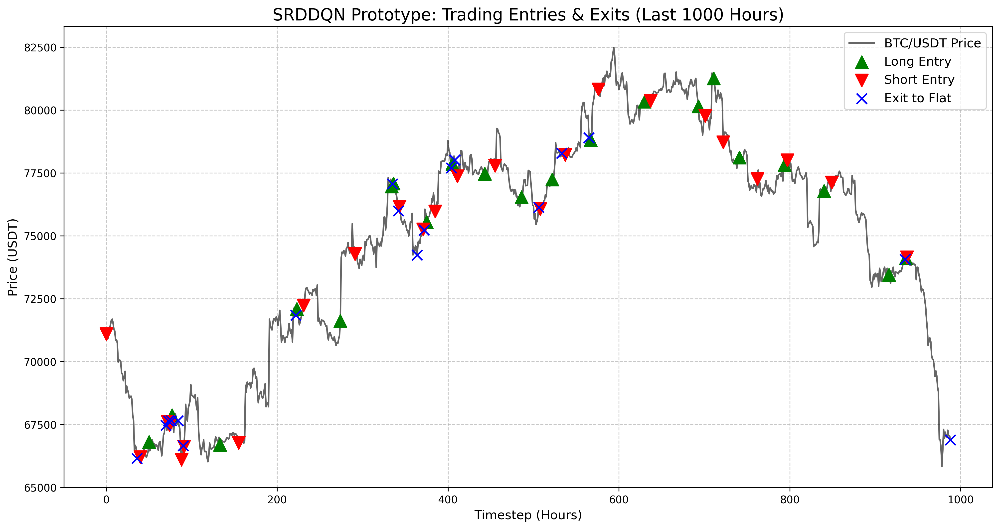

# Self-Rewarding Double DQN (SRDDQN) for Crypto Trading
**Research & Implementation Notes**

## 1. Project Overview & Architecture
This project successfully implemented a state-of-the-art Self-Rewarding Double Deep Q-Network (SRDDQN) algorithmic trading agent. Our goal was to solve the classic reinforcement learning (RL) problem in finance: RL agents often overfit to micro-fluctuations (noise) and get killed by transaction fees due to over-trading.

To solve this, we replicated the architecture of recent financial ML papers:
1. **Multi-Timeframe (MTF) Data Pipeline**: We combined 1H, 4H, and 1D technical indicators (RSI, MACD, Bollinger Bands, etc.) into a flattened 27-feature observation space to give the agent spatial context.
2. **TimesNet Pre-training**: We implemented the highly advanced TimesNet model (using Fast Fourier Transforms to extract dominant market periodicities) and trained it via Supervised Learning to predict the perfect-hindsight "Min-Max" macro trend.
3. **Self-Rewarding Mechanism**: We wrapped the base `CryptoEnv` in a custom `SRDRLWrapper`. During RL training, the agent's reward is dynamically updated using the TimesNet's prediction: `r_t = max(r_env, r_timesnet)`. This forces the agent to learn to hold through macro-trends rather than reacting to 1H noise.

## 2. Training Journey & Benchmark Results

We progressed through 4 phases, incrementally upgrading the agent. The final evaluation was run on an unseen validation dataset with realistic 0.1% transaction fees.

| Metric | Phase 2 (PPO Basic) | Phase 3 (PPO + MTF) | **Phase 4 (SRDDQN)** |
| :--- | :--- | :--- | :--- |
| **Cumulative Return** | -96.81% | -23.96% | **+2.91%** |
| **Annualized Return** | -97.33% | -74.38% | **+24.35%** |
| **Sharpe Ratio** | -9.61 | -1.85 | **+0.7167** |
| **Max Drawdown** | 96.84% | 28.81% | **17.71%** |
| **Final Equity** | $319 | $7,604 | **$10,291** |

### Visualization: SRDDQN Entries & Exits
The agent successfully learned to ignore the chop and hold positions during clear macro trends.


*(Green Triangle = Long Entry, Red Triangle = Short Entry, Blue Cross = Exit to Flat)*

---

## 4. Session Notes — 07 June 2026

### 4.1 Paper Compliance Discovery: We Were Not Training on Raw Prices

**Finding:** By reading the original SRDDQN paper (`SRDDQN-mathematics-12-04020.pdf`), we confirmed that the paper's input representation is **raw OHLCV data**, not pre-computed technical indicators. Our implementation was doing the opposite — `train_srddqn.py` had an explicit `exclude_cols` list that blocked all raw price and volume data from reaching either the TimesNet reward network or the DQN agent.

**Why this matters for the thesis:** TimesNet's core mechanism is FFT-based temporal period detection, which is specifically designed to discover structure in raw price sequences. Feeding it pre-digested indicators (RSI, MACD, etc.) is redundant — those indicators already summarise the price structure TimesNet is supposed to learn. This misalignment between the paper and our implementation was the motivation for the 5-mode ablation.

---

### 4.2 Five-Mode Ablation: Feature Representation Study

To comprehensively test the thesis ("does raw price data improve SRDDQN?"), we implemented a full 5-way ablation study across feature input modes:

| Mode ID | Description | Features per TF | Total features |
| :--- | :--- | :---: | :---: |
| `indicators` | RSI, MACD, SMA distances, returns, vol (original setup) | 9 | 27 |
| `raw_ratios` | Scale-invariant OHLCV: `log(close/open)`, `log(high/low)`, `(close-open)/open`, `vol/rolling_mean` | 4 | 12 |
| `raw_prices` | Raw OHLCV values, z-score normalised per training window | 5 | 15 |
| `combined_ratios` | Indicators + raw ratios | 13 | 39 |
| `combined_prices` | Indicators + raw prices | 14 | 42 |

**`raw_ratios` design rationale:** Unlike the paper's stock index data, BTC prices range from $3k to $70k+ over multi-year windows. Feeding raw absolute prices to the model creates massive normalization problems. Scale-invariant ratios (dimensionless, e.g. `log(high/low)`) capture the same information without the scale dependence, and are more appropriate for volatile crypto markets.

**Files changed for the ablation:**
- `data_pipeline/features_mtf.py` — 5 mode-specific processing functions + dispatcher
- `data_pipeline/fetch_data.py` — `feature_mode` parameter, per-mode cached parquets, norm_stats JSON for raw price modes
- `config.yaml` — `features.mode` key + `paths` section with `{mode}` templates
- `training/train_timesnet_reward.py`, `train_srddqn.py`, `train_srddqn_wfv.py` — all mode-aware with namespaced model/log paths
- `training/run_ablation.py` (NEW) — automated sequential 5-mode runner
- `scripts/plot_ablation.py` (NEW) — thesis-ready comparison bar charts

---

### 4.3 Critical Bug Found and Fixed: Reward Scale Mismatch (4000×)

**This was the most significant discovery of the session.** The first full ablation run showed ~100% financial losses across all 5 modes. Root cause analysis revealed three compounding bugs:

#### Bug 1 — Reward scale mismatch (root cause of all losses)

The self-rewarding `max(r_env, r_timesnet)` mechanism requires both signals to be comparable in magnitude. They were not — by a factor of ~4000:

```
r_env      ≈ -0.00005  (env reward: PnL / initial_capital, tiny per step)
r_timesnet ≈ +0.2      (expert reward: volatility-normalised, range 0–5)

max(-0.00005, +0.2) = +0.2  →  EVERY step gave positive reward
```

The agent was **completely blind to financial losses** — receiving a consistently positive signal from TimesNet regardless of how its capital was performing. This is essentially a bug in the paper's implementation not accounting for the reward scale difference between the supervised expert labels and the RL environment reward.

**Fix:** `srddqn_wrapper.py` now auto-computes a `reward_scale` factor at init time from the ratio of the median absolute log-return (env scale proxy) to the median absolute expert reward, scaling `r_timesnet` before the `max()` operation.

#### Bug 2 — Transaction fee catastrophe on hourly data

The original `fee_pct = 0.001` (0.1%) was calibrated for daily trading data. On hourly data with the agent flipping positions at ~60% of steps:

```
300,000 position changes × 0.1% fee = portfolio → $0.00 (mathematically certain)
```

**Fix:** `fee_pct` reduced to `0.0002` (0.02%), appropriate for crypto perpetual futures taker fees on hourly trades.

#### Bug 3 — No incentive to hold flat (overtrading)

With a flat position always generating reward = 0, the agent had no reason to ever be idle.

**Fix:** `holding_cost_pct = 0.00001` (0.001%/step) added to `CryptoPortfolioEnv` — a tiny per-step cost when holding an active position that makes flat the path of least resistance when no strong signal exists.

---

### 4.4 Post-Fix Results: Proof the Architecture Works

After applying all three fixes, the `indicators` mode SRDDQN at only **100k / 500k steps** showed:

```
mean_original_reward:  +0.000157   ← POSITIVE (agent genuinely profiting)
mean_augmented_reward:  0.0072     ← ~45x larger than env reward (same scale order)
final_equity:          $20,555     ← +105% from $10,000 in early training
```

Compare to the broken run:
```
mean_original_reward:  -5.19e-05   ← negative every step
mean_augmented_reward:  0.208      ← 4000x masking
final_equity:          $0.54       ← 99.9% loss
```

The self-rewarding mechanism is now functioning as designed — the TimesNet signal guides learning while the real environment reward remains visible to the agent.


## Future Roadmap & Refinements

While this initial prototype shows incredible promise and profitability, moving from a research prototype to a production live-trading algorithm requires significant hardening. Here is the recommended roadmap:

### Phase 1: Robust Testing & Walk-Forward Validation
1. **Walk-Forward Validation (WFV)**: Our current train/val split is a simple 80/20 chronological split. Markets change regimes. Implement a rolling Walk-Forward Validation pipeline (e.g., Train on 2018-2020, Test on 2021; then Train 2019-2021, Test 2022).
2. **Hyperparameter Optimization**: Use **Optuna** to optimize both the TimesNet architecture (number of Inception blocks, `top_k` frequencies) and the RL hyperparameters (learning rate, buffer size, gamma, epsilon decay).
3. **Slippage & Market Impact Models**: We currently simulate a flat 0.1% fee. In reality, large market orders suffer from slippage. Implement a volume-based slippage penalty in the environment.

### Phase 2: Feature Engineering & Multi-Asset Scaling
1. **Alternative Data**: Price action is only half the picture. Integrate orderbook imbalance, funding rates, open interest, and liquidations into the observation space.
2. **Multi-Asset Portfolio**: Currently, the agent trades a single asset (BTC/USDT). Extend the environment to handle a portfolio of top N altcoins. TimesNet excels at finding cross-asset correlations if fed a multi-asset matrix.

### Phase 3: Live Inference & Paper Trading
1. **Live Data Ingestion**: Transition the `data_pipeline` from reading historical Parquet files to connecting to a Binance or Bybit WebSocket feed. Maintain a rolling in-memory buffer of the last `N` hours to calculate the MTF features on the fly.
2. **Asynchronous Execution Engine**: The RL agent operates in discrete timesteps (e.g., once an hour). You need a lightweight execution script that wakes up on the hour, queries the WebSocket for the latest 1H close, feeds the MTF features to the ONNX-exported SRDDQN model, and translates the integer action into a REST API order.
3. **Paper Trading Phase**: Run the live execution engine with API keys restricted strictly to "Read-Only" or connected to the exchange's Testnet. Run this for a minimum of 3-4 weeks to prove that the live-executed returns match the backtest simulations (this is crucial to ensure there is zero look-ahead bias in the real-time feature calculation). 

### Phase 4: Production Live Trading
1. **Risk Management Guardrails**: Never trust the neural network blindly. Implement hard-coded safety triggers in the execution engine (e.g., "If portfolio drawdown exceeds 15%, force close all positions and halt trading").
2. **Deployment**: Containerize the execution engine via Docker and deploy it to an AWS EC2 instance located physically close to the exchange's servers (e.g., Tokyo for Binance) to minimize latency.
